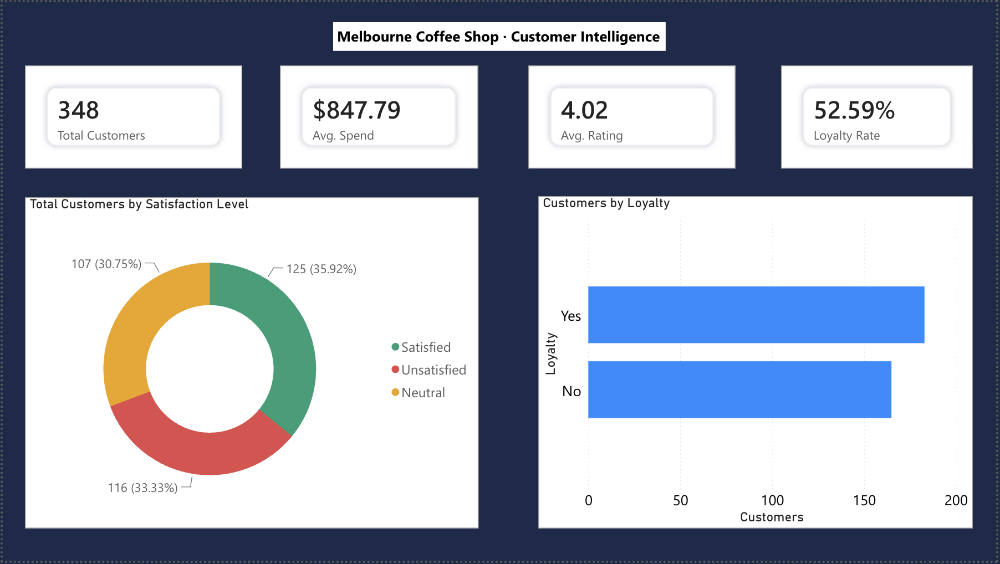
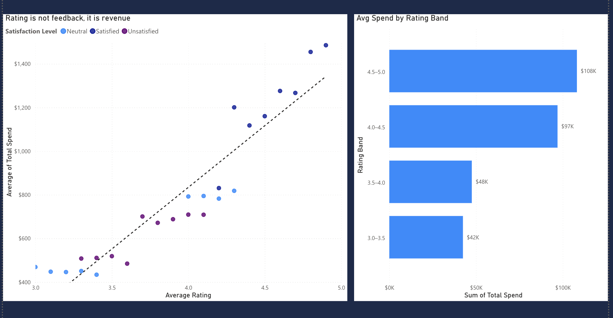
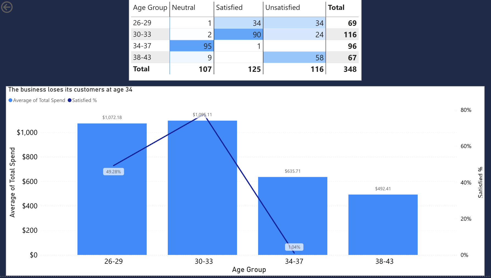
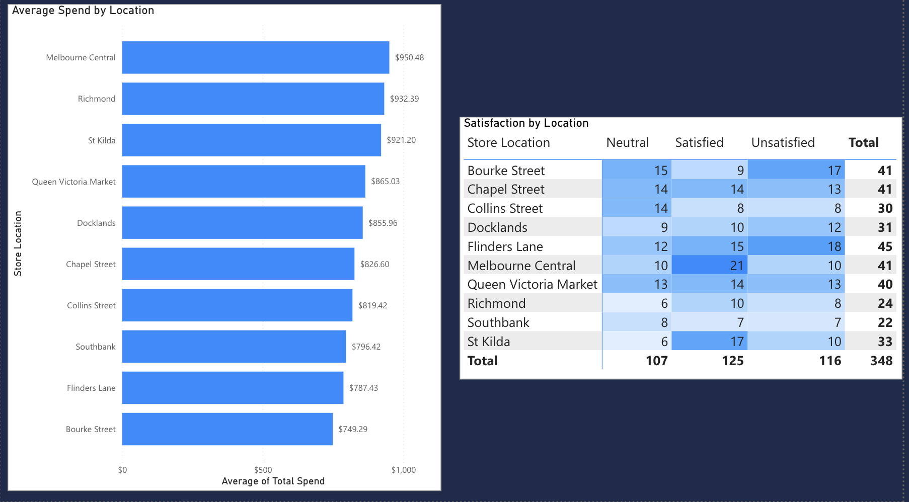
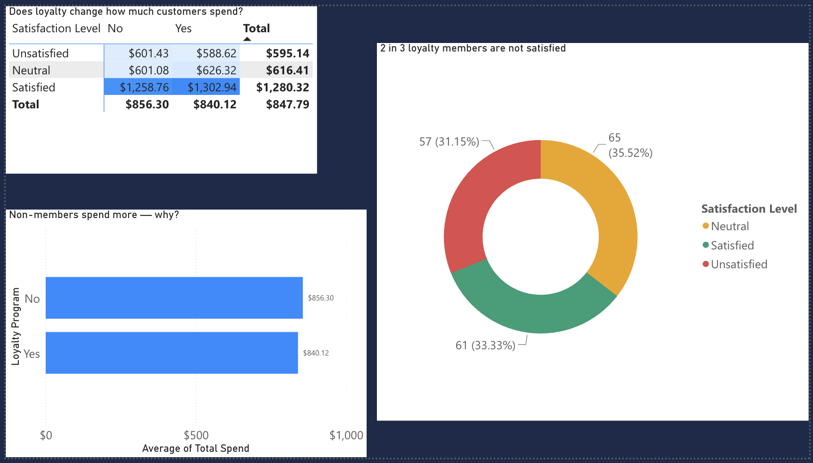
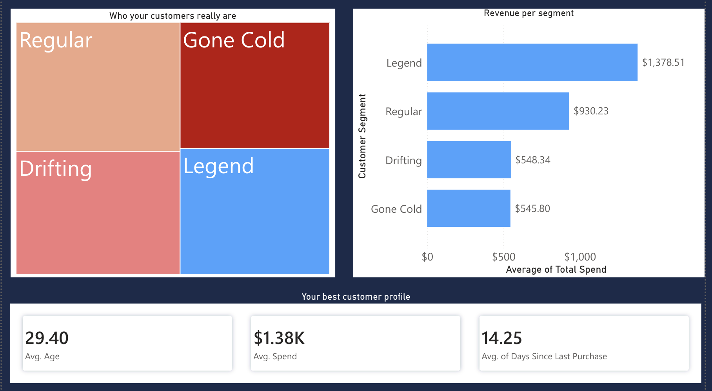

# melbourne-coffee-shop-analysis
Melbourne Coffee Shop · Customer Behaviour Analysis
Overview
This project is a business intelligence analysis of customer behaviour across 10 Melbourne coffee shop locations. The goal was not to build a dashboard but to find the business decisions hiding inside the data. The analysis was done in Power BI with DAX measures, RFM segmentation, and cross-dimensional breakdowns across satisfaction, loyalty, age and location.
What the data revealed
Customer satisfaction is not a service metric. It is a revenue metric. Average rating correlated with total spend at 0.94 accuracy. A customer rating their experience at 3.0 spent $471 on average. A customer rating 4.5 or above spent $1,386. That is a 3x revenue gap driven entirely by experience quality, not product, not location, not loyalty status. Low rated customers represented $28,653 in recoverable revenue if their experience improved to mid tier.
The business has an age problem it probably does not know about. Customers aged 30 to 33 were 78% satisfied and spent $1,095 on average. Customers aged 34 to 37 were 1% satisfied and spent $631. Customers aged 38 and above were 0% satisfied and spent $492. One person out of 98 customers aged 34 and above was satisfied. If this pattern holds as younger customers age the business has a 5 to 7 year window before its most profitable cohort becomes its most dissatisfied one.
The loyalty program enrolled the wrong people. Non members spent $856 on average. Loyalty members spent $840. That $16 gap looks like a program failure. It is not. When satisfaction was controlled for, satisfied non members spent $1,259 and satisfied loyalty members spent $1,303. Unsatisfied non members spent $601 and unsatisfied loyalty members spent $589. Loyalty membership moved spend by less than $50 in either direction. Satisfaction moved it by over $700. The program did not fail because of poor design. It failed because 66% of enrolled members were neutral or unsatisfied at the time of analysis.
RFM segmentation identified four distinct customer groups. Legends numbered 103 customers, averaged $1,378 in spend, and had visited within the last 14 days on average. Regular customers numbered 73 and averaged $930. Drifting customers numbered 108, averaged $548, and represented the single highest ROI intervention opportunity in the dataset. Gone Cold customers numbered 66 and averaged $546.
Dashboard structure
The Power BI report is structured across 6 pages. The Overview page establishes the headline numbers. Rating = Revenue makes the correlation case visually. Age Cliff shows the demographic breakdown. Location compares store performance by spend and satisfaction. Loyalty deconstructs the program paradox. Segments maps the RFM framework across the customer base.
Tools used : Power BI Service, DAX, Power Query
Files in this repository : The CSV dataset and dashboard screenshots are included. The Power BI report is published and linked below.
What I would recommend to this business
The data points to four specific actions:
First, stop growing the loyalty program until overall satisfaction improves. 66% of current members are not satisfied and adding more dissatisfied members does not change that.
Second, run a targeted win back campaign for the 108 Drifting customers before they move to Gone Cold. The spend gap between Drifting and Regular is $382 per customer meaning converting even half of them generates over $20,000 in recovered revenue.
Third, investigate Bourke Street and Flinders Lane as priority locations. Bourke Street had the lowest average spend in the dataset at $741 and the second highest unsatisfied count at 17 customers. Flinders Lane had 18 unsatisfied customers despite having the second highest Legend count in the network meaning the right customers are there but something in the experience is limiting their spend.
Fourth, take the age cliff seriously. It is not a coincidence that satisfaction drops to near zero above age 34. Something structural in the product, atmosphere or value proposition is misaligned with what customers want as they get older and addressing it now is a retention play worth making before the current 30 to 33 cohort ages into the same pattern.
## Dashboard Preview

### Overview

### Rating = Revenue

### Age Cliff

### Location Analysis

### Loyalty Deep Dive

### Customer Segments

## Live Dashboard
View the full interactive report here: https://app.powerbi.com/groups/bb8201e6-a93d-43a0-97c3-bd6500e428a4/reports/494c2df2-c350-4091-97e5-5057d0b05f04/f2346cbb276264b5475b?experience=power-bi
